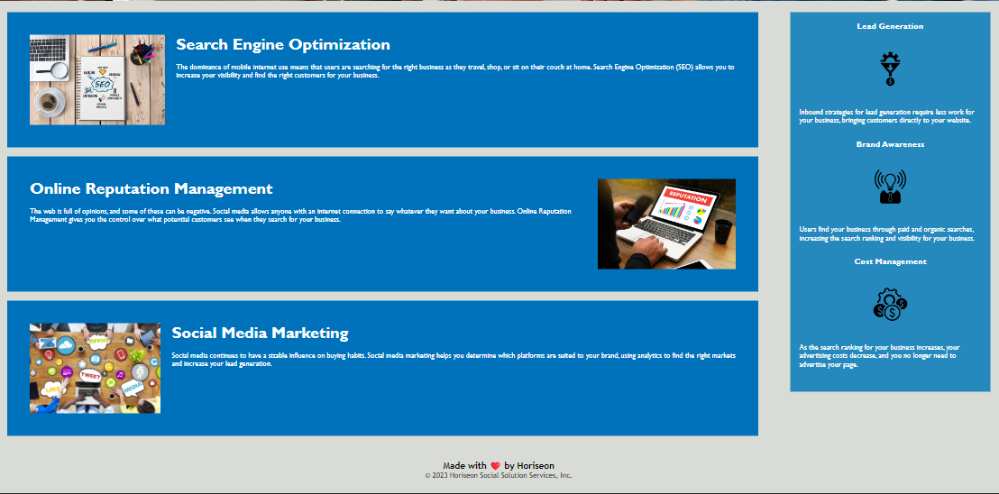

# HTML CSS Git Challenge: Code Refactor 

# Description   
This project is a code refactor by Horriseon homepage. The purooses of this refactioring is to make the code more efficient comprehemsible and accessibls. This refactiorins should also result in
improved search engine optimiztion. The modification doesn't change the display styling or page only the underlying code.

# Tasks completed 
- HTMl element were replaced with semantioc HTML element 
- Alt text was added to images 
- In HTML docoment explanntory comment were provided
- The title a descriptive was added

# Screeshot 

# Links

Link to the code repsitory : https://github.com/KittiyaLooknam/css-demo-site.git

# Installation 

Upload index.html and assets folder to the depoloyed webserver. the assets folder contains images and css files.

# Usage

The application designed for desktop viewing. It not add media for smaller screens yet.

# Credits

- https://www.w3schools.com/html/html5_semantic_elements.asp
- https://www.w3schools.com/html/html5_semantic_elements.asp
- Thank you to Louis Delia for advice.